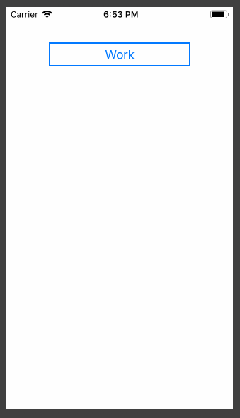
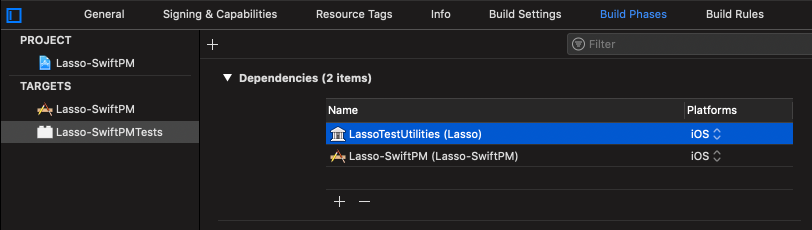

# Lasso Swift Package Manager Sample

This is a sample standalone iOS app that uses Swift Package Manager to bring in Lasso and LassoTestUtilities as dependencies.  This sample app contains a very simple Flow with two Screens - along with unit tests:

The simplest way to add Lasso to your project is through Xcode's `File` -> `Swift Packages` -> `Add Package Dependency...` menu.  Enter `https://github.com/ww-tech/lasso.git` for the package URL.

One thing you might need to manually add is the LassoTestUtilities dependency to your test target:

