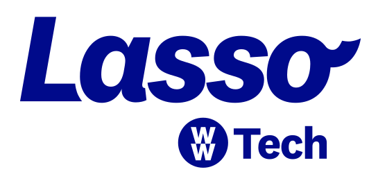
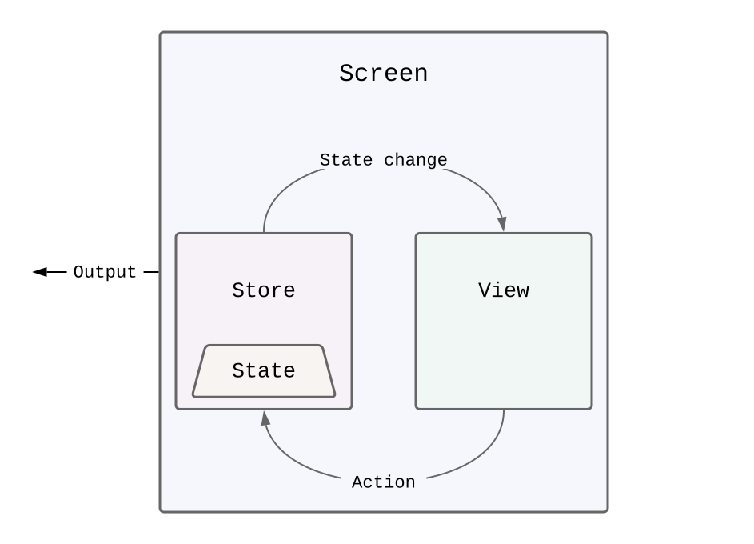
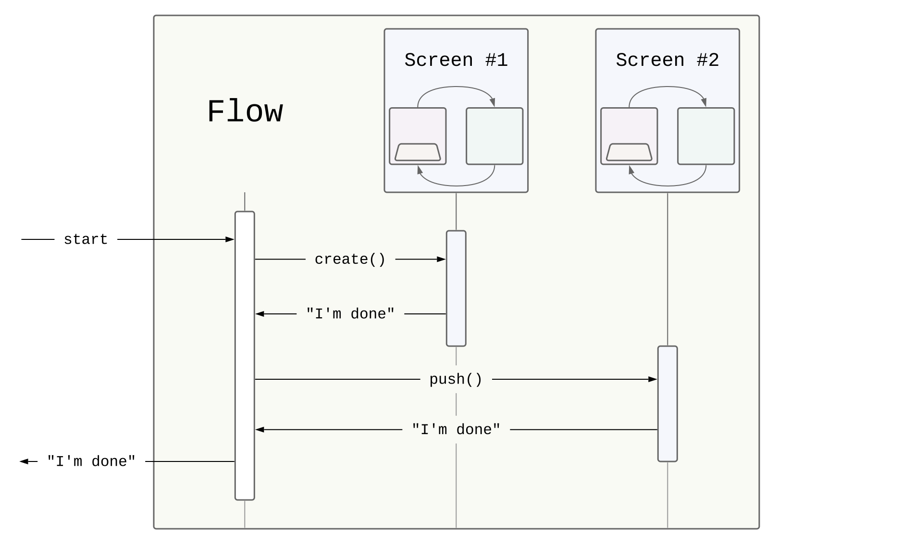
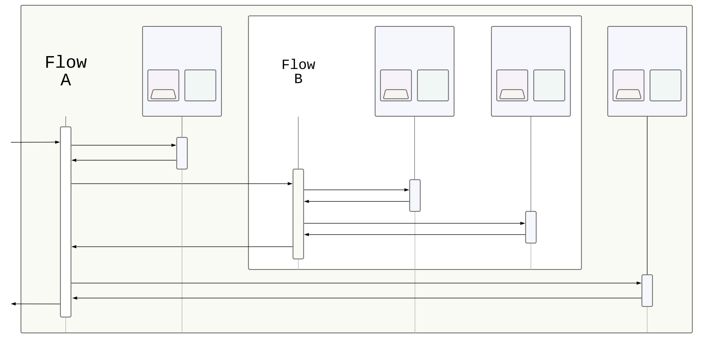

<h1 align="center"></h1>
<p align="center">
    
    
</p>

Lasso is an iOS application architecture for building discrete, composable and testable components both big and small - from single one-off screens, through complex flows, to high-level application structures.


## Why Lasso?

Without a set of structural principles, it's very easy for an application's code base to become hard to both reason about, and maintain.  In particular, these problems will eventually arise:

- tight coupling of components makes it hard to change/test things
- business logic living in strange places makes it hard to modify/reuse/debug/test existing code
- view presentation choices made in inappropriate places makes it hard to refactor/reorganize/test flows
- inconsistent organization across team makes it hard to cross-contribute


## The Lasso way

Lasso encourages a strong separation of concerns by clearly defining discrete, single-responsibility components where specific types of code should live, and a clear, flexible way for these components to communicate.  Larger units of behavior are easily composed, and re-composed.

### Screens

We generally think of a screen as a single page/view in an app - e.g., a login view, a contacts list view, an audio settings view, etc.

In Lasso, a `Screen` is the collection of types used to implement a single view:

<p align="center"></p>

The `View` (i.e., a `UIViewController`) is responsible for:

- accurately rendering the current `State` (i.e., the content) of the screen
- forwarding user interactions to the `Store` (i.e., the decision maker)
- responding to state changes to keep the presentation up to date

Lasso views tend to be small, with practically zero logic in them.

A **unidirectional data flow** is used to ensure consistency: a `View` never re-renders anything in direct response to a user action.  `Views` send `Actions` to the `Store`, which updates the `State`, which come back to the `View` as `State` change notifications.

The `Store` is where a screen's decisions are made, and is the source of truth for the screen's `State`.  A `Store` is responsible for:

- all business logic for the screen
- responding to `Actions` (i.e. events sent from the `View`)
- updates to the screen's `State`

A `Store` can also generate an `Output` when an event occurs that is more appropriately handled elsewhere.  E.g., a login screen might generate a "user did login" output as a signal to a higher-level system to move to a logged-in portion of an app; or a contact list screen might generate a "did select contact" output as a signal to a higher-level flow to either present or push a contact detail screen.

### Flows

A `Flow` represents a feature - or area - of an app, and is commonly composed of a collection of `Screens`.  For example, a "new user" flow might be composed of a series of one-time informational screens followed by a single "let's get started" screen.

<p align="center"></p>

A `Flow` is instantiated and started within an appropriate context of a view hierarchy (e.g., a "sign up" flow might be presented on a menu screen, or a "welcome" flow might be pushed onto a navigation stack).  The `Flow` starts by creating its initial `Screen`, and listens for `Output` signals.  As `Outputs` arrive, the `Flow` decides what to do with them - it can create and place another `Screen` into the view hierarchy, emit its own `Output` (when an event occurs that is more appropriately handled elsewhere), or whatever is appropriate for the `Flow`.

Since `Screens` and `Flows` are encapsulated modules with discrete entry and exit points, it's quite easy and common for a `Flow` to manage both `Screens` _and_ `Flows`.  In this way, it becomes possible to define your application as a hierarchy of components, reducing complexity from the top level down.

<p align="center"></p>

## Example App

To run the example project

1. Clone the Lasso repo
2. Run `pod install` from the `Example` directory
3. Open up `Lasso.xcworkspace`


## Learn more

- [Lasso: Introducing a new architectural framework for iOS](docs/Lasso-Introduction-part1.md) - article that introduces Lasso, with a concrete example of creating a `Screen`
- [Lasso: An introduction to Flows](docs/Lasso-FlowsIntro.md) - article that shows how to orchestrate a number of `Screens` with a `Flow`
- [Lasso coding style guilde](docs/style-guide.md) - tips for writing Swifty Lasso


## Requirements

Lasso supports **iOS 10 and up**, and can be compiled with **Swift 4.2 and up**.


## Installation

### Cocoapods

The core Lasso framework is added to the primary target in your Podfile:

```ruby
Pod 'Lasso'
```

Also add `LassoTestUtilities` to your test target(s):

```ruby
Pod 'LassoTestUtilities'
```


### Swift Package Manager

The Lasso package URL is:

```
`https://github.com/ww-tech/lasso.git`
```

For sample usage, see: [Swift Package Manager Sample](Example/SwiftPM/ReadMe.md).


## Contributing

We love contributions!

If you have a feature in mind, and/or have found a bug, the best thing to do is:

1. Search the issues to see if someone has already brought it up!
2. Create a new issue that explains in detail the improvements you'd like to see.
3. If you have a code change in mind, that's awesome!
   1. Fork the Lasso repo
   2. Create a branch for your feature change
   3. Open a PR!


## Authors

[Steven Grosmark](https://github.com/g-mark), [Trevor Beasty](https://github.com/trevor-beasty), Yuichi Kuroda, and the WW iOS Team.


## License

Lasso is licensed under the [Apache-2.0 Open Source license](http://choosealicense.com/licenses/apache-2.0/).

You are free to do with it as you please.  We _do_ welcome attribution, and would love to hear from you if you are using it in a project!
