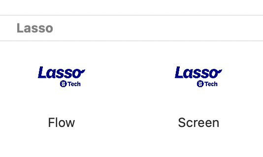
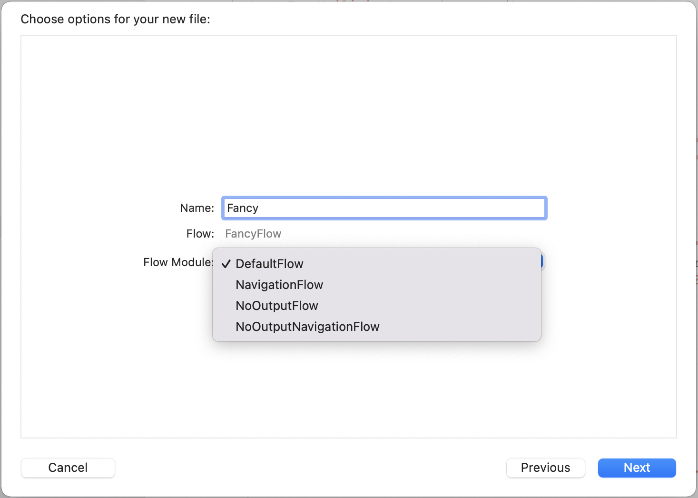
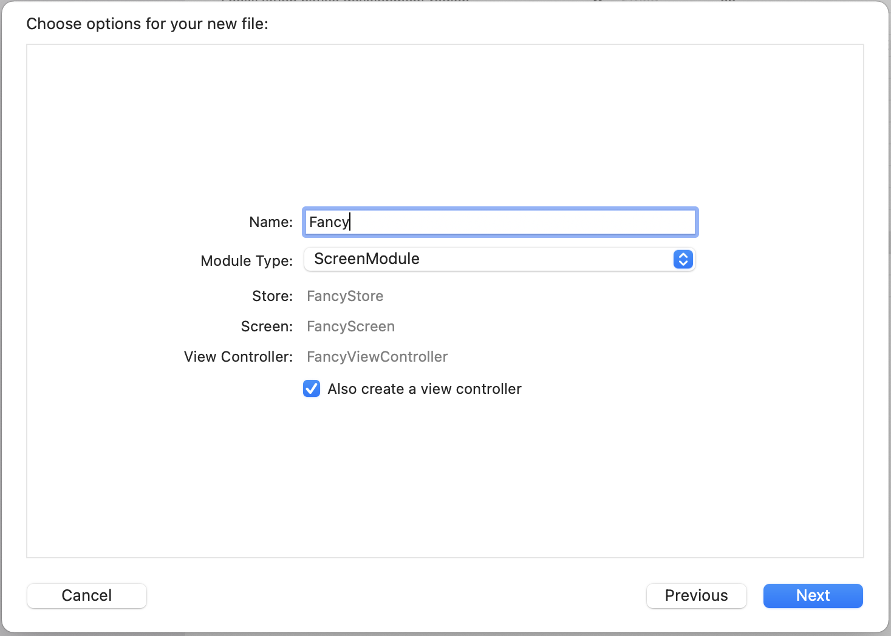

# Lasso Templates

Xcode templates to automatically generate Lasso components, including: 
 - Flow and FlowModule.
 - Screen: State, Action and Output.
 - Store. 
 - View.

## Templates 

The `Flow` and `Screen` templates appear in a `Lasso` group in the Xcode template browser. 



### Flow Template options:

- Name for the flow to create. 
- Flow Module type: 
  - `DefaultFlow` (Default).
  - `NavigationFlow`.
  - `NoOutputFlow`.
  - `NoOutputNavigationFlow`.



### Screen Template options:

- Name for the screen to create. 
- Module type: 
  - `ScreenModule` (Default).
  - `StoreModule`.
- Checkbox for creating a view controller (Defaults to true).



## Installation

### Manually 

To install Lasso Xcode templates, run:
```make
make install
```

To uninstall Lasso Xcode templates, run:
```make
make uninstall
```

### Add post-install step to your Podfile

```ruby 
post_install do |installer|
  
  installer.pod_targets.each do |pod|
    if pod.name == "Lasso"
      path = File.expand_path("#{Dir.pwd}/Pods#{pod.pod_target_srcroot}")
      system("make -C #{path}/Templates install")
    end
  end
  
end 
```
