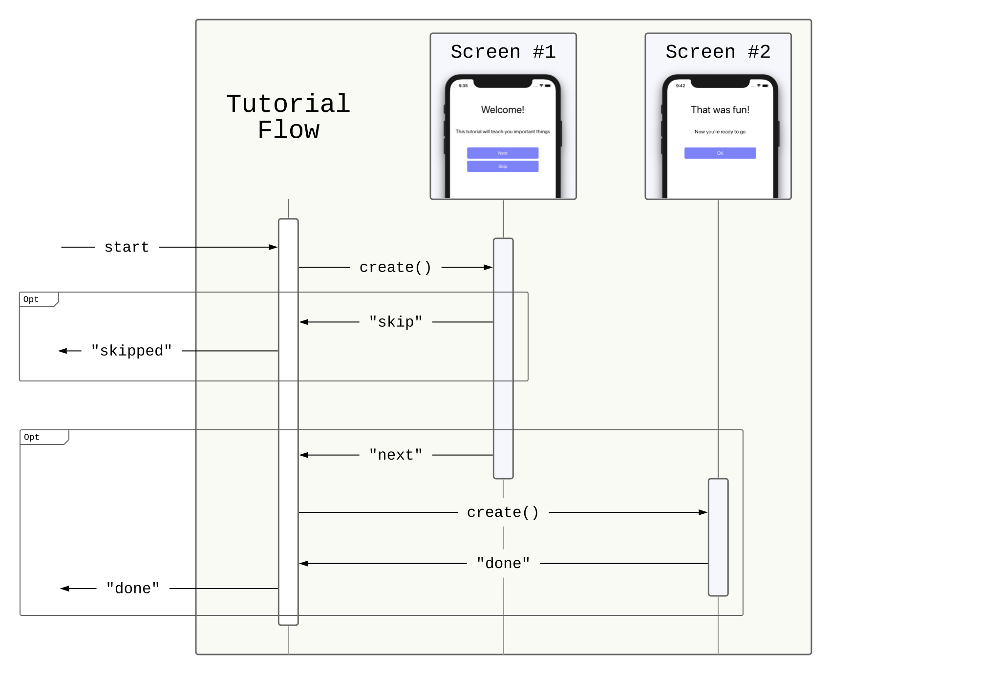

# Lasso: An introduction to Flows
Most iOS applications have some sense of navigation — a user will progress from screen to screen as they utilize the features of an app.  In iOS development, the class `UIViewController` is primarily responsible for such navigation.  Transitions from screen to screen are realized as side effects in the view controller hierarchy (navigation hierarchy).

Typically, view controllers are responsible for creating and presenting other controllers.  This results in lots of coupling between controllers.  As a result, it becomes difficult to:

* Reuse similar sequences of screens in varying contexts
* Easily modify an app's high level navigation structure
* Effectively implement complex relationships across screens
* Effectively test related sequences of screens

Lasso solves all of these problems via its `Flow` abstraction.

## What is a Flow?

A `Flow` represents a feature - or area - of an app, and is commonly composed of a collection of `Screens`.  For example, a "new user" flow might be composed of a series of one-time informational screens followed by a single "let's get started" screen.


A `Flow` is instantiated and started within an appropriate context of a navigation hierarchy (e.g., a "sign up" flow might be presented on a menu screen, or a "welcome" flow might be pushed onto a navigation stack).  The `Flow` starts by creating its initial `Screen`, and listens for `Output` signals.  As `Outputs` arrive, the `Flow` decides what to do with them.  It can create and place another `Screen` into the navigation hierarchy, emit its own `Output` (when an event occurs that is more appropriately handled elsewhere), or do whatever else is appropriate for the `Flow`.

Since `Screens` and `Flows` are encapsulated modules with discrete entry and exit points, it's quite easy and common for a `Flow` to manage both `Screens` _and_ `Flows`.


From a functional perspective, `Flows` are a mechanism for composition — they aggregate smaller independent units of behavior into larger ones.  `Flows` themselves may also be composed. This makes it possible to define the views that constitute an application as a hierarchy of `Flows`.  Describing an app's features in this way drastically reduces complexity and increases maintainability. 

## Implementing a Flow
Let's say that business has crunched the numbers, and they've decided that we need to provide a short tutorial to our members to enhance new member onboarding.  The feature calls for a series of views with images and text describing the program.  A user completes the tutorial by progressing forward through all of the views.



How can we implement this the Lasso way?  First, we must define the structural types of our `Flow`.

The types that constitute a `Flow's` structure are defined in a `FlowModule`.  This is simply a convenience for grouping the member types of a specific `Flow`, namely its `Output` and `RequiredContext`.

`Output` defines the messages that a `Flow` can propagate outward to some unknown higher level object.  These `Output` messages constitute the modular boundary of the `Flow`.

`RequiredContext` describes the type of `UIViewController` artifact a `Flow` requires to make side effects in the navigation hierarchy.  A `Flow` uses this object's native API to present and dismiss `Screens`.  `RequiredContext` makes it possible to implement the behavior of a set of `Screens` agnostic to any other (unknown) `Screens` that may precede or follow them.

```swift
enum TutorialFlowModule: FlowModule {
  
  enum Output: Equatable {
    case didFinish
    case didPressSkip
  }
  
  typealias RequiredContext = UINavigationController
  
}
```
There are several user actions our tutorial `Flow` must respond to.  On the first screen, we see a "next" and a "skip" button.  Our `Flow` must execute some logic in response to the user pressing these buttons.  It will handle the "next" button press by creating and showing the second screen.  However, it is not responsible for handling the "skip" button press; some higher level object will be responsible for driving the app in response to this event.  This logical design is realized by including `didPressSkip` as an `Output` case.  When the user presses "skip", our `Flow` will simply emit `didPressSkip` as an `Output`.

On the second screen, we see a "done" button.  When this button is pressed, our `Flow` is finished — it has no further screens to show.  This is embodied by the `didFinish` case of `Output`.  Our `Flow` will emit this message when the "OK" button is pressed.  As before, some higher level object will need to respond to this message, progressing the application according to its broader business logic.

We would like to create the effect that the user is progressing forward through the tutorial screens.  To satisfy this, we will use the "push" API on `UINavigationController`.  Our `Flow` needs a way to specify this requirement — our `Flow` must be _started_ in a navigation controller and be able to make "push" calls on that navigation controller.  This is achieved by stating that the `RequiredContext` is of type `UINavigationController`.  

We are now ready to implement our `Flow`:

```swift
class TutorialFlow: Flow<TutorialFlowModule> {

  override func createInitialController() -> UIViewController {
    // create, configure and return the first view controller
  }
  
}
```
`TutorialFlow` inherits from `Flow` and is generic over `TutorialFlowModule`.  We begin by overriding its `createInitialController()` method.  This is the entry point for a `Flow` implementation.  The `UIViewController` returned by this method will be placed into the navigation hierarchy when the `Flow` is _started_.

The screen we'll use in `createInitialController` will be from `TutorialScreenModule`. In fact, this module is set up so that we can use it for the second screen of the tutorial as well. The important parts of this module are:

```swift
enum TutorialScreenModule: ScreenModule {

  struct State: Equatable {
    let title: String
    let body: String
    let buttonTitles: [String]
  }
  
  enum Output: Equatable {
    case didPressButton(index: Int)
  }
  
  ...
}
```
We can create conveniences that describe the two screens of `TutorialFlow` in terms of `TutorialScreenModule.State`.

```swift
extension TutorialScreenModule.State {

  static var welcome: State {
    return State(title: "Welcome!", body: "...", buttonTitles: ["Skip", "Next"])
  }
  
  static var finish: State {
    return State(title: "That was fun!", body: "...", buttonTitles: ["OK"])
  }

}
```
We are now ready to implement `createInitialController()`, using `TutorialScreenModule` to create and return the "welcome" screen.
 
```swift
override func createInitialController() -> UIViewController {
  let welcomeState = TutorialScreenModule.State.welcome
  let introScreen = TutorialScreenModule.createScreen(with: welcomeState)
  return introScreen.controller
}
```
It is important to note that a `Flow` is retained by the view controller returned in `createInitialController()`.  This ARC consideration is handled behind the scenes by creating a strong reference from the 'initial view controller' to the `Flow`.  This means that a `Flow` will live as long as its initial controller.  

Next, we must implement the second screen in this `Flow`.  We want to show the "finish" screen when the user presses the "next" button.  This is accomplished by observing the `Output` of the welcome screen and responding appropriately.

```swift
class TutorialFlow: Flow<TutorialFlowModule> {

  override func createInitialController() -> UIViewController {    
    let welcomeState = TutorialScreenModule.State.welcome
    let introScreen = TutorialScreenModule.createScreen(with: welcomeState)
    
    introScreen.observeOutput({ [weak self] output in
        guard let self = self else { return }
        switch output {
        
        case .didPressButton(index: let index):
          switch index {
          case 0:
            // handle skip
            
          case 1:
            let finishController = self.assembleFinishController()
            self.context?.pushViewController(finishController, animated: true)
            
          default:
            return
          } 
        }
    })
      
    return introScreen.controller
  }
  
  private func assembleFinishController() -> UIViewController {
    let finishState = TutorialScreenModule.State.finish
    let finishScreen = TutorialScreenModule.createScreen(with: finishState)
    return finishScreen.controller
  }
  
}
```
`TutorialFlow` observes the `Output` of the "welcome" screen, capturing `self` weakly in order to avoid retain cycles.  When `TutorialFlow` receives the `didPressButton` message from that screen, it must evaluate the associated `index` value to determine which button was tapped.  We know that this screen has two buttons: "skip" and "next."  The indices of these buttons correspond to the `buttonTitles` property on `State` — "skip" corresponds to an index value of 0, and "next" to a value of 1.

The "finish" screen is constructed in the same manner as the welcome screen.  It is placed into the navigation hierarchy by calling `pushViewController(:animated:)` on the local `context: UINavigationController?`.  By definition, the `context` property always reflects the `RequiredContext` type.  It is an optional because it is weakly owned by the `Flow`, which is necessary to avoid retain cycles.

We can now finish our `TutorialFlow` implementation.  When the user clicks the "OK" button on the finish screen, the tutorial is completed.  

```swift
private func assembleFinishController() -> UIViewController {
  let finishState = TutorialScreenModule.State.finish
  let finishScreen = TutorialScreenModule.createScreen(with: finishState)
    
  finishScreen.observeOutput({ [weak self] output in
    guard let self = self else { return }
    switch output {
      
    case .didPressButton(index: let index):
      switch index {
        
      case 0:
        self.dispatchOutput(.didFinish)
          
      default:
        return
    }
  })
    
  return finishScreen.controller
}
```
When the "finish" screen emits the `didPressButton` output, `TutorialFlow` does not execute any side effects.  Instead, it simply emits the `didFinish` output via its `dispatchOutput(:)` method.  `TutorialFlow` is not aware of what may happen following the tutorial, but it is responsible for communicating that the tutorial was completed.  It will be the role of some other object to drive the app when the tutorial completes.

The "skip" button press on the welcome screen can be handled in a similar fashion.  Our `TutorialFlow` is only responsible for propagating this event as an output.  

```swift
introScreen.observeOutput({ [weak self] output in
    guard let self = self else { return }
    switch output {
        
    case .didPressButton(index: let index):
      switch index {
      case 0:
        // handle skip
        self.dispatchOutput(.didPressSkip)
        
      ...
    }
})
```

## Starting a Flow
Now that we have defined our `Flow`, we need some way of _starting_ it.  We would like to present the screens that constitute our `Flow`, making the requisite side effects in the navigation hierarchy. 

`TutorialFlow` has a `RequiredContext` of `UINavigationController`.  This is equivalent to the `TutorialFlow` saying:

"I need some UINavigationController to work with. It doesn't matter if I start at the root of that navigation controller, or on top of a navigation stack with many controllers in it. As long as I'm provided a starting point in some navigation controller, and am able to make calls on it, I will be able to do my job"

`TutorialFlow` has been defined in isolation and does not currently participate in the broader app.  We can potentially show it in many different places with varying navigation hierarchy characteristics.

We could start `TutorialFlow` in some navigation controller, pushing its initial controller on top of the navigation stack.

```swift
let tutorialFlow = TutorialFlow()
tutorialFlow.start(with: pushed(in: navigationController))
```

Alternatively, we could start `TutorialFlow` at the root of some navigation controller, removing any view controllers currently in its stack.

```swift
let tutorialFlow = TutorialFlow()
tutorialFlow.start(with: root(of: navigationController))
```

Here, `root(of:)` and `pushed(in:)` are utilities that return a `ScreenPlacer<UINavigationController>`, a novel Lasso type.  The `ScreenPlacer` abstraction is critical to `Flow` modularity - `ScreenPlacer` bridges the gap between UIKit and `Flows`, allowing us to _start_ a sequence of screens defined in isolation.  It is important to understand the mechanics and intuition of the `ScreenPlacer` type.

### Understanding `ScreenPlacer`
A `ScreenPlacer` creates side effects in the navigation hierarchy.  Specifically, its job is to _place_ a single `UIViewController` into the navigation hierarchy.  `ScreenPlacer` has a notion of "navigation context" - it describes the resulting context of the _placed_ controller.  A `ScreenPlacer` does not reveal how such placement will occur.  This enables `ScreenPlacer` clients to be agnostic to the details of placement.

`ScreenPlacer` is a general structure for which any number of instances may be defined.  This structure is flexible enough to satisfy all navigation hierarchy use cases possible in `UIKit`.

To understand `ScreenPlacer` more deeply, we must first examine the `Flow` base class.

```swift
open class Flow<Module: FlowModule> {

  public private(set) weak var context: Module.RequiredContext?

  public func start(with placer: ScreenPlacer<Module.RequiredContext>) { ... }
  
}
```
Here, we see that the `start(with:)` method requires a `ScreenPlacer` argument.  The passed-in `ScreenPlacer` must be generic over the `RequiredContext` of the `Flow`.  We also see that `Flow` holds a weak reference to its context, which is of type `RequiredContext`.

`ScreenPlacer` is simply a value wrapper over a`place(:)` function.

```swift
public struct ScreenPlacer<PlacedContext: UIViewController> {

  public func place(_ viewController: UIViewController) -> PlacedContext { ... }

}
```
Conceptually, a `ScreenPlacer` abstracts away the specifics of making side effects in the navigation hierarchy.  A `ScreenPlacer` client only needs to provide the `UIViewController` to be _placed_ without caring about how that placement will occur.  The `place(:)` function returns the `PlacedContext` - an object reflecting the navigation hierarchy that the `UIViewController` was placed into.  As seen in the definition above, the `PlacedContext` is simply some `UIViewController` type.  The returned `PlacedContext` object can be used to execute subsequent navigation hierarchy side effects.

When _started_, a `Flow` _places_ its initial controller into the navigation hierarchy by calling `place(:)` on the passed-in `ScreenPlacer`.  The `PlacedContext` object returned by `place(:)` is then written to `context`.  The `Flow` can make calls on this object to show other screens later on. 

We can now revisit the `pushed(in:)` placer and study it in more detail, outlining its implementation details.

```swift
let tutorialFlow = TutorialFlow()
tutorialFlow.start(with: pushed(in: navigationController))
```

The `ScreenPlacer` created by `pushed(in:)` _places_ the initial controller of `TutorialFlow` into the navigation hierarchy by calling the native method `pushViewController(:animated:)` on the passed-in navigation controller.  The `pushed(in:)` placer then returns the passed-in navigation controller as the `PlacedContext`.  This navigation controller is set as `TutorialFlow'`s `context`.  `TutorialFlow` executes subsequent navigation hierarchy side effects by making calls on this `context`.  In the case of `TutorialFlow`, we know that it will eventually call `pushViewController(:animated)` on its `context` in order to show the "finish" screen.

A compilation error will occur if we attempt to start a `Flow` with an inappropriate `ScreenPlacer`:

```swift
let tutorialFlow = TutorialFlow()
tutorialFlow.start(with: presented(on: viewController)) // ERROR
```

Here, `presented(on:)` returns a `ScreenPlacer<UIViewController>`.  This means that `TutorialFlow` will be provided a context object of type `UIViewController`.  This is inadequate.  We know that `TutorialFlow` needs to be able to push controllers onto a navigation stack, requiring a context object of type `UINavigationController`.  

This compilation failure is incredibly valuable.  Our code will not compile if we violate the explicit requirements of a `Flow`.  `Flows` can thus be chained together with confidence — the compiler will tell us when we have broken a screen sequence.

### ScreenPlacers and UIViewController Embeddings

`ScreenPlacers` also support view controller embeddings.  In Lasso, view controller embeddings are composable with respect to `ScreenPlacers` — an embedding can be "chained along" to any `ScreenPlacer` instance.  Intuitively, if I have some `ScreenPlacer` instance, I can place some container view controller with that placer.  I can then place some other view controller into that container.  This is precisely how `ScreenPlacer` embeddings work.

We could start `TutorialFlow` in a modally presented navigation controller.

```swift
let tutorialFlow = TutorialFlow()
tutorialFlow.start(with: presented(on: viewController).withNavigationEmbedding())
```

We could even start `TutorialFlow` as one of many tabs in a `UITabBarController`.  Here, `TutorialFlow` is placed as the second of two tabs.

```swift
let tutorialFlow = TutorialFlow()
let tabPlacers: [ScreenPlacer<UITabBarController>] = tabBarEmbedding(UITabBarController(), tabsCount: 2)
tutorialFlow.start(with: tabPlacers[1].withNavigationEmbedding())
```

We have seen many built-in `ScreenPlacer` conveniences.  Lasso contains many such conveniences covering typical UIKit use cases.  Lasso clients are not limited to this built-in set of placers — the `ScreenPlacer` API is completely extensible.  Clients can create custom extensions as desired in support of custom containers and less common use cases. 

## What's the Point?
In concert, `Flows` and `ScreenPlacers` are the ultimate tools for describing and implementing  an application's sequences of screens. 

Lasso flips the implicit model provided by Apple on its head.  In typical iOS development, view controllers are responsible for creating and presenting other controllers.  This results in lots of coupling between controllers, which destroys modularity and makes reuse / testing very difficult.  As new features are added, the codebase inevitably warps into a monolith.

In Lasso, `Flows` encapsulate sequences of `Screens`.  Thanks to `ScreenPlacers`, these `Flows` can be started anywhere in the application.  What's more, because both `Screens` and `Flows` are explicitly modular, they can be freely composed, all the while maintaining modularity of the resulting higher level objects.  This design pattern results in minimal coupling and scales well as the feature set grows.  

Thus, Lasso moves us from a world with inherent coupling to one with inherent modularity.  This quality incurs many benefits:

* Reusing related collections of `Screens` is trivial.
* Related collections of `Screens` can be effectively tested in isolation.
* Construction and mocking is clean.
* Composition is at our fingertips.  We can create all types of new behaviors by aggregating smaller, existing ones.
* Top level application code is much more expressive and maintainable.  Where we used to have references to low level controllers, we now have references to higher level abstractions that encapsulate feature sets.

### Is that All?

We have only begun to scratch the surface: `Stores`, `Screens`, and `Flows` can be wielded in a surprising number of ways, giving the developer precision control over the logical design of their application.  What's more, Lasso's companion library, `LassoTestUtilities`, provides a mechanism for writing expressive and succinct `Flow` unit tests.  These topics will be addressed in future articles.

Interested in joining the WW team? Check out the careers page to view technology job listings as well as open positions on other teams.