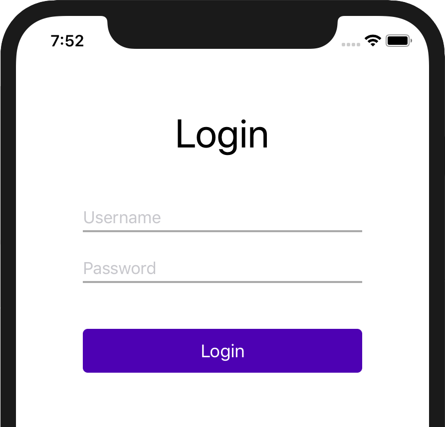
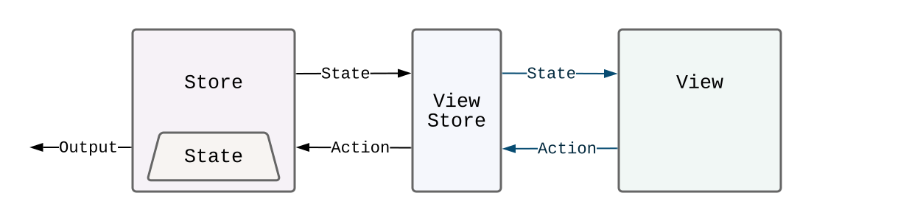

# Lasso: Introducing a new architectural framework for iOS

### Problem statement

Without a set of structural principles, it's easy for an application's code base to become difficult to reason about and maintain.  In particular, there's a good chance that you'll eventually start to see these kinds of problems:

- tight coupling of components, making it hard to change or test things
- business logic living in strange places, making it difficult to modify, reuse, debug, and test existing code
- view presentation choices made in strange places make it hard to refactor, reorganize, and test flows
- inconsistent organization across the team makes it hard to cross-contribute

### Use an architecture!

If you're starting a new project, then you have the luxury of putting some sort of architectural standard in place *before* you start writing any code.  If you already have a code base set up (and are probably experiencing some of the above issues), then it will be a little more difficult to adopt something new.

What are your choices?  Well, you know you need *some* kind of guiding structure, so you just need to pick one of the many options: MVC, MVVM, VIPER, MVI, or the topic of this article: **Lasso**!

### Introducing Lasso

Lasso is an iOS application architecture for building discrete, reusable, and testable components both big and small–from single one-off screens to complex flows and high-level application structures.

There are two main areas of writing an application where Lasso aims to help: creating individual view controllers and managing the interplay between your view controllers.  In Lasso, we call these these **screens** and **flows**.

## Screens

We generally think of a screen as a single page/view in an app. For example: a login view, a contacts list view, or an audio settings view.

In Lasso, a `Screen` is the collection of types used to implement a single view:

- `Store` - the business logic
- `Action` - a message [usually] sent from a view controller to the Store in response to some sort of user interaction
- `State` - the content to be presented in the view controller
- `Output` - a message sent from a screen that enables composing screens into flows

A `View` isn't a formal type in Lasso, but we do talk about them a lot.  When we do, we almost always mean a `UIViewController`.

Drawing this up in a diagram allows us to see how these types work together:

<p align="center"></p>
You should notice what looks like a **unidirectional data flow**.  The `View` translates user interactions into `Action` messages, which are sent to the `Store`.  The `Store` processes the `Action` messages and updates the `State`.  Changes to the `State` are sent back to the `View` as they happen.

### Building a login screen

To provide a context for talking about how to create and show a `Screen`, we'll use the task of creating a simple login screen.

<p align="center"></p>

#### Defining a `ScreenModule`

The first step in constructing a screen is to declare the needed `ScreenModule` namespace.  The `Screen`'s value types (i.e. `Action` and `State`) are declared here.  The  `ScreenModule` protocol glues these types together and serves as the main "public" entry point for creating a `Screen`.

We declare a case-less enum that conforms to `ScreenModule` for our login screen:

```swift
enum LoginScreenModule: ScreenModule {
  
}
```

The first value type to add to the `LoginScreenModule` is `State`.  `State` will contain all of the data needed for the `Screen`.  Our login screen will track the username and password as it is entered by the user and also display any errors that come up.

```swift
  struct State: Equatable {
    var username: String = ""
    var password: String = ""
    var error: String? = nil
  }
```

The `ScreenModule` additionally needs to know what a default `State` value looks like, so that it can use one as a part of the `Screen` creation process.  This is done by implementing the required `defaultInitialState` computed static var.  Since each of the properties in our `State` declaration has a default value assigned to it, this function is super simple:

```swift
  static var defaultInitialState: State {
    return State()
  }
```

Next, we declare all of the `Action` values for our login screen.  `Actions` are single-purpose messages sent from the `View` (i.e. `UIViewController`) in response to a user interaction.  The simplest set of actions we can have for our login screen includes when each of the text fields' value changes and when the user taps the "login" button:

```swift
  enum Action: Equatable {
    case didUpdateUsername(String)
    case didUpdatePassword(String)
    case didTapLogin
  }
```

It's up to you to name the cases in a way that makes sense, but using a past-tense verb is preferred since it emphasizes the fact that the view is a thin layer of user interactions in a unidirectional data flow system.

The next type to define in the module is the `Output`.  An `Output` is a message emitted from a screen to communicate events that the screen itself doesn't handle.  For example, our login screen can't (and shouldn't) make any decisions about what happens when a user successfully logs in, so it will emit a "user is now logged in" `Output` message.  A `Flow` (which is described in detail later), will listen for these signals, and act accordingly by replacing the login screen with a screen only available to logged in users.

Our login screen will have a single `Output` (using the same past-tense feel):

```swift
  enum Output: Equatable {
    case userDidLogin
  }
```

The [almost] complete module declaration now looks like this:

```swift
enum LoginScreenModule: ScreenModule {
  
  enum Action: Equatable {
    case didUpdateUsername(String)
    case didUpdatePassword(String)
    case didTapLogin
  }
  
  enum Output: Equatable {
    case userDidLogin
  }
  
  struct State: Equatable {
    var username: String = ""
    var password: String = ""
    var error: String? = nil
  }
  
  static var defaultInitialState: State {
    return State()
  }
  
}
```

It's _almost_ the complete declaration because we need to define the `Store` in order to complete the module.

#### Defining a `Store`

Every `Screen` has a `Store` associated with it, which is defined as a `LassoStore` subclass.

```swift
final class LoginScreenStore: LassoStore<LoginScreenModule> {
  
}
```

The `LassoStore` base class is generic on your `ScreenModule` so it can have knowledge of the module's types, and provide the functionality that makes it a `Store`.  Because of the generic requirement, our `LoginScreenStore` is declared outside of the `LoginScreenModule` namespace.

There is one required override for handling `Actions` that we need to add, where we simply `switch` over all possible `Action` values.

```swift
  override handleAction(_ action: Action) {
    switch action {
    
    case .didUpdateUsername(let username):
      
    case .didUpdatePassword(let password):
    
    case .didTapLogin:
    }
  }
```

When a new `username` or `password` arrives, the `Store` needs to update the current `state` with the new values.  Updates to the state are achieved by using an `update` function provided by the `LassoStore` base class, like this:

```swift
    case .didUpdateUsername(let username):
      update { state in
      	state.username = username
      }
      
    case .didUpdatePassword(let password):
      update { state in
      	state.password = password
      }
```

To specify the changes to make, you provide the `update` function with a closure that does the actual updating, similar to how you would provide a closure to `UIView.animate` to change the view properties to animate.  The `update` function executes your closure with a `state` value for you to modify, and then makes sure all of the appropriate "state change" notifications are sent to the `View`.

Handling the button tap `Action` is a little different, because there isn't a field to update.  This action will initiate an asynchronous call to a login service, and on success emit the `userDidLogin` `Output`.  This is what the login service API looks like:

```swift
enum LoginService {
  static func login(_ username: String,
                    _ password: String,
                    completion: @escaping (Bool) -> Void) {
    ...
  }
}
```

Using the login service, the handler for the `didTapLogin` action will need to:

1. Call `LoginService.login` to initiate the login
2. Update the `error` state property if needed
3. Emit the `userDidLogin` `Output` if needed, using the `dispatchOutput()` function (provided by the `LassoStore` base class)

```swift
    case .didTapLogin:
      LoginService.login(state.username,
                         state.password) { [weak self] success in
        self?.update { state in
          state.error = success ? nil : "Invalid login"
        }
        if success {
          self?.dispatchOutput(.userDidLogin)
        }
      }
```

The complete `LoginScreenStore` now looks like this:

```swift
final class LoginScreenStore: LassoStore<LoginScreenModule> {
  
  override handleAction(_ action: Action) {
    switch action {
    
    case .didUpdateUsername(let username):
      update { state in
      	state.username = username
      }
      
    case .didUpdatePassword(let password):
      update { state in
      	state.password = password
      }
      
     case .didTapLogin:
      LoginService.login(state.username,
                         state.password) { [weak self] success in
        self?.update { state in
          state.error = success ? nil : "Invalid login"
        }
        if success {
          self?.dispatchOutput(.userDidLogin)
        }
      }
    }
  }
  
}
```

#### Defining the view controller

The final part of the `Screen`-types puzzle is the view controller.  Our `LoginScreenViewController` will just be a plain `UIViewController`, constructed through code, and conforming to `LassoView`

```swift
final class LoginScreenViewController: UIViewController, LassoView {
  
}
```

The first thing we need to add to our `LoginScreenViewController` is a reference to the `Store` that is driving it.  Before we do that though, there is a separation-of-concerns issue that needs to be dealt with.  In theory, we could simply provide the login view controller a reference to a `LoginScreenStore`.  This would certainly _function_, but it exposes much more of the store than the view should have access to, such as emitting outputs or modifying the state.

Instead of the full `LoginScreenStore`, we'll use a more restricted version that's specifically designed for use in a view - a `ViewStore`.  A `ViewStore` is a proxy to a `Store` that is strictly limited to read-only `state` access and the ability to dispatch an `Action` - this provides a `View` with _exactly_ what it needs.

<p align="center"></p>

A `ViewStore` type is automatically declared for you as a part of a `ScreenModule`, based on the declared `Action` and `State` types, so we can start to use the `LoginScreenModule`'s `ViewStore` immediately:

```swift
final class LoginScreenViewController: UIViewController, LassoView {
  
  let store: LoginScreenModule.ViewStore
  
  init(_ store: ViewStore) {
    self.store = store
  }
}
```

Now we can start connecting the store (i.e. the _view_ store) to the UIKit components in the view controller.  We won't go into the details of creating all the controls and setting up their layout constraints here, but you can see the full source code in the GitHub repo for this article.  Suffice it to say that we have the following components properly created and laid out in our view controller:

```swift
  private let usernameField: UITextField
  private let passwordField: UITextField
  private let errorLabel: UILabel
  private let loginButton: UIButton
```

The fields and label need to get populated with the content in the `Store`'s state, _and_ get updated when that state changes.  This is all accomplished by setting up state observations on the store.  We can set up all our observations in a helper function, using the `observeState` method on the `store`:

```swift
  private func setUpBindings() {
    store.observeState(\.username) { [weak self] username in
      self?.usernameField.text = username
    }
    store.observeState(\.password) { [weak self] password in
      self?.passwordField.text = password
    }
    store.observeState(\.error) { [weak self] error in
      self?.errorLabel.text = error
    }
  }
```

`observeState` has a few variations - the one above uses a `KeyPath` to specific `State` properties to listen for changes to individual fields.  The closure will be called whenever the field's value changes _and_ when setting up the observation – this is a good way to set up the initial view state.

That takes care of all the state change notifications coming into the `View`.  Now we need to send some actions as the user interacts with the view.  You can send an action directly to the `store` by calling its `dispatchAction()` method.  For example, if we had an action for when the view appeared (say for analytics purposes), we could write this:

```swift
  override func viewDidAppear() {
    store.dispatchAction(.viewDidAppear)
  }
```

For our login screen, we are only sending actions in direct response to user input, and we can take advantage of some of the many helpers for binding UIKit controls to actions.

For text changes, we can call `bindTextDidChange(to:)` on the UITextField.  The closure maps the new text value to one of the `Action` values:

```swift
    usernameField.bindTextDidChange(to: store) { text in
      .didUpdateUsername(text)
    }
```

For button taps, we can call `bind(to: action:)` on the UIButton:

```swift
    loginButton.bind(to: store, action: .didTapLogin)
```

All of these helpers set up the UIKit notifications/actions/etc., and call `dispatchAction()` on the `store` for us.

Our complete (minus the control set up) `LoginScreenViewController` now looks like this:

```swift
final class LoginScreenViewController: UIViewController, LassoView {
  
  let store: LoginScreenModule.ViewStore
  
  init(_ store: ViewStore) {
    self.store = store
  }
  
  override func viewDidLoad() {
    // omitted for clarity: create/layout the UIKit controls
    setUpBindings()
  }
  
  private let usernameField: UITextField
  private let passwordField: UITextField
  private let errorLabel: UILabel
  private let loginButton: UIButton
	
  private func setUpBindings() {
    // State change inputs:
    store.observeState(\.username) { [weak self] username in
      self?.usernameField.text = username
    }
    store.observeState(\.password) { [weak self] password in
      self?.passwordField.text = password
    }
    store.observeState(\.error) { [weak self] error in
      self?.errorLabel.text = error
    }
    
    // Action outputs:
    usernameField.bindTextDidChange(to: store) { text in
      .didUpdateUsername(text)
    }
    passwordField.bindTextDidChange(to: store) { text in
      .didUpdatePassword(text)
    }
    loginButton.bind(to: store, action: .didTapLogin)
  }
  
}
```


#### Pulling it all together

We can now add the last required part of the `LoginScreenModule`, which is a static `createScreen` function that provides clients of the module a method for creating an instance of our login screen.  We waited until the end because this function needs to reference both the `LoginScreenStore` and `LoginScreenViewController`.

```swift
enum LoginScreenModule: ScreenModule {
  ...
  
  static func createScreen(with store: LoginScreenStore) -> Screen {
    return Screen(store, LoginScreenViewController(store.asViewStore()))
  }
}
```

Declaring `createScreen` fulfills the remaining type requirement of a `ScreenModule`, which is the concrete `Store` type associated with the `Screen` – in our case the `LoginScreenStore`.

#### Instantiating the screen

With all of the types defined, we can finally instantiate one of our login screens, and fortunately, it's super easy.

```swift
let screen = LoginScreenModule.createScreen()
```

The above version of `createScreen` will use the `defaultInitialState` value we defined (in the `LoginScreenModule`) to create our `LoginScreenStore`.  This is perfect for when our pretend app launches for the first time, but let's say we wanted to remember our users and pre-populate the login screen so only the password is needed.  We can achieve this by calling `createScreen` with a different initial state, like this:

```swift
let prePopulated = LoginScreenModule.State(username: "Billie")
let screen = LoginScreenModule.createScreen(with: prePopulated)
```

The actual `Screen` type is really just a container for the created `Store` and `UIViewController`:

```swift
screen.store	// LoginScreenStore
screen.controller // LoginScreenViewController
```

We can push the controller onto a navigation stack:

```swift
navigationController.pushViewController(screen.controller, animated: true)
```

There are also some convenience functions on `Screen` that essentially pass through to the `Store`. For example, if we want to observe the `Output` from the screen, we can call `observeOutput()` right on the `screen` variable, which simply calls the store's function:

```swift
screen.observeOutput { [weak self] output in
  switch output {
    case .userDidLogin:
      // do something post-login
  }
}
```

#### Unit testing

Creating unit tests for a `Screen` is quite straight forward, no excuses!  Since the view controllers are used purely for displaying the current `State` to a user, you can instantiate a `Store`, send it some actions, and test against the resulting state:

```swift
func test_LoginScreen_changeUsername() {
  let screen = LoginScreenModule.createScreen()
  screen.store.dispatchAction(.didChangeUsername("mom"))
  XCTAssertEqual(screen.store.state.username, "mom")
}
```

Similarly, it's easy to listen for outputs, and test against them:

```swift
func test_LoginScreen_didLogin() {
  var outputs = [LoginScreenModule.Output]()
  let screen = LoginScreenModule
  	.createScreen()
  	.observeOutput { outputs.append($0) }
  screen.store.dispatchAction(.didTapLogin)
  XCTAssertEqual(outputs, [.userDidLogin])
}
```

In addition to the above ad-hoc style of testing, there are a few different helpers that make writing unit tests a joy.  Take a look at the [Lasso GitHub repo](https://github.com/ww-tech/lasso) for a bunch of examples!

### Recap

Hopefully, you've gained a sense of how easy it is to use Lasso as an architectural framework for the views in your app.  The process we followed to create the sample login screen in this article is the same process you can use to create your own screens:

- Create a `ScreenModule` that defines a set of `Action`, `State`, and `Output` value types
- Create a `LassoStore` subclass to hold all your business logic, responding to your `Action` values by updating your `State`, and emitting `Output` when appropriate.
- Create a `UIViewController` that forwards all user interactions as `Action` values to the `Store` and observes the `State` to keep the UI in sync.

Once you have more than one screen defined, you'll want to start exploring how you can tie them together using a `Flow`.  Flows employ the same ideology of separation of concerns to enable a highly modular, easy to understand, and testable application code base.

The source code for this article is available in its own project [here](https://github.com/ww-tech/lasso-article-examples).

Check out [Lasso on GitHub](https://github.com/ww-tech/lasso), take it for a spin, and let us know what you think!

